# Quality Control & Post-GWAS Analyses I

```
$ echo "Data Sciences Institute"
```
------

# What You Will Learn Today


- **Quality Control (QC) essentials for GWAS**: why QC matters and common filters.
- **From discovery to validation**: replication criteria and why signals may not replicate.
- **Hands-on GWAS walkthrough (1 hour)**: end-to-end tutorial from input to association output.
- **What GWAS teaches us**: polygenicity, effect sizes, and cross-ancestry considerations.
- **Post-GWAS fine-mapping basics**: Regular approaches and Bayesian approaches.
------

# Quality-Control (QC)

- QC is mandatory in genetic studies.

- Sample quality depends on DNA source (e.g., blood vs. buccal), handling, and storage.

- Error profiles **vary by platform**.

- **Random** genotyping error → lower power, no systematic bias.

- **Non-random** error → can inflate **false positives**.

   - For example, case/control imbalances (different batches, labs, technologies).

- Avoid convenience controls that don’t match cases.

-------

# Genotype Calling

- Then vs. now: Early studies relied on manual inspection of electrophoresis gels; modern studies use fully automated pipelines.

- How calls are made: Algorithms use allele-specific intensity signals for each SNP and assign the most likely genotype.

- Platform specificity: Different genotyping platforms employ their own calling algorithms, tuned to their chemistry and probe design.


------

# Genotype Calling

- Historically: manual calls from gels; now automated from allele intensity data.
- Algorithms infer genotypes for each SNP using two-allele intensities.
- Different platforms use different callers.


-------

# Typical Quality Filters

- GWAS include hundreds of thousands of SNPs and thousands of samples; even a 1\% error rate yields a substantial number of SNPs and samples with errors.
- Remove SNPs and samples with excessive **missing or failed calls**.
- Extensive QC is performed prior to association testing to prevent non-random errors from inflating false positives.

----

# Filtering Steps

- **MAF \& missingness**: Drop SNPs with MAF < 5\% (study-dependent) and remove SNPs or samples with >~5\% missing calls.
- Hardy-Weinberg equilibrium: **Exclude SNPs showing HWE departures** (e.g., $P_{\text {HWE }}<0.001$), which often indicate genotyping error.
- Mendelian consistency: In pedigree data, remove SNPs with excess **Mendelian errors**.
- **Relatedness checks**: Identify cryptic relatives or duplicates; unmodeled relatedness inflates test statistics and false positives.
- After QC, evaluate the dataset with a quantile-quantile (Q-Q) plot to confirm that the test statistic distribution matches expectation (no residual inflation).


------

# Q-Q plots


- Q-Q plots can diagnose systematic inflation or deflation of test statistics (e.g., uncorrected population stratification, batch effects).
- If most variants are truly null $\rightarrow$ points lie on the $45^{\circ}$ line.
  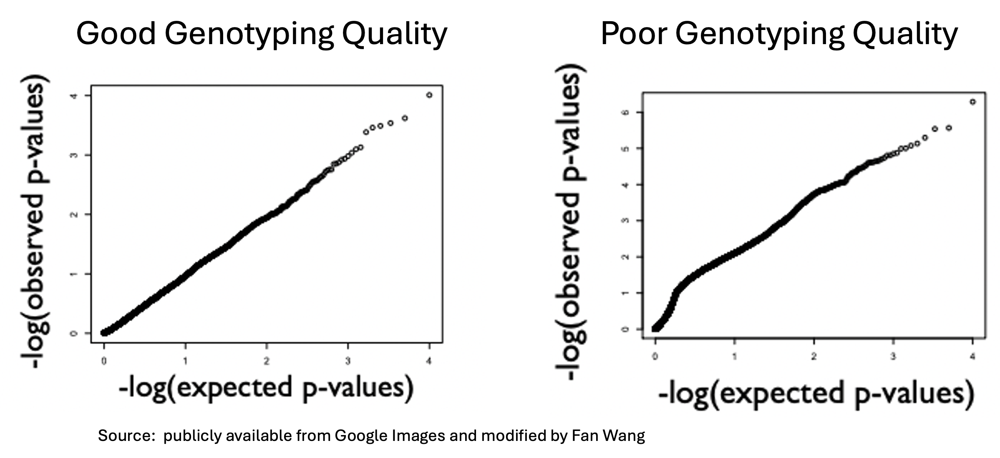
  
- Important caveat: Many traits are polygenic; widespread weak effects can cause mild upward deviation even with good QC.

-----


# Replication vs. Non-replication

- After a new association is reported, it should be validated in an independent cohort.
- Genotype the same SNP in an independent sample and test the association again.
- Replication criteria (very strict):
  - The SNP attains statistical significance ( $\alpha = 0.05$ ).
  - Same genetic model is supported (additive, dominant, recessive, etc.).
  - Effect direction matches the discovery (risk $\leftrightarrow$ protective).
  - The replication study has adequate power (typically $80-90\%$ ).
- Note: Failure to replicate does not automatically invalidate the original finding.

------

# Why a Result Might Not Replicate

- **False positive** in the discovery study.

- **Insufficient power** in the replication sample.

- The tested SNP is a **tag** (in LD with the causal variant); **LD differences** across populations can break the signal.

- **Context dependence**: effect sizes can vary with covariates (e.g., age), study phenotype definition, or other design differences.

------

## GWAS tutorial


------


# What have we learned so far from GWAS?

<!--
By performing GWAS studies, scientists have successfully identified the
association of hundreds of thousands to millions of SNPs to a single
phenotype. 


Example of GWAS catalog /extracted from lei's slides
-->

- Large-scale GWAS have mapped hundreds of thousands to millions of SNP-phenotype associations.
- Example (2021): The GWAS Catalog listed 4,865 publications and 247,051 associations.
  - These reported SNPs help illuminate molecular mechanisms of common diseases and the biological pathways underlying traits of interest.
- Associations for some SNPs linked to rare diseases have been tested intensively.
- Yet classic GWAS alone have not yielded solid, mechanistic insight into how variants drive phenotypes.

-------

# GWAS SNP-Trait Discovery Timeline


  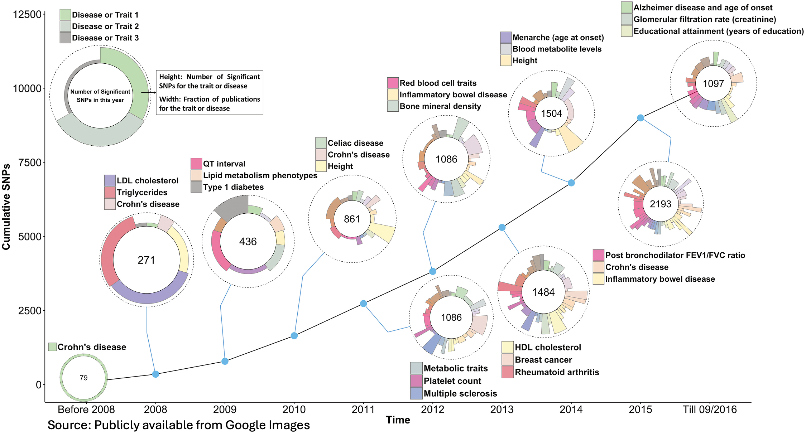


-------

# Practical Lessons from GWAS

- Complex traits are highly polygenic, with thousands of variants contributing small increments of risk or trait change.

- For common variants, single-variant effect sizes are typically modest; odds ratios frequently fall in the 1.05-1.20 range.

- For height, a well-powered model trait, the effect sizes are on the order of $\sim 1$ millimeter.

- Because effects are small and testing is genome-wide, large cohorts are needed to reach stringent significance (e.g., $\mathrm{p}<5 \times 10^{-8}$ ).


--------

# Practical Lessons from GWAS

- A GWAS peak typically marks a cluster of nearby variants (about 10–100 kb) that move together because of linkage disequilibrium.

- Multiple independent association signals can reside within the same locus.

- The majority of GWAS associations lie outside protein-coding exons; these variants are believed to act mainly by regulating gene expression (e.g., enhancer or promoter activity) rather than by changing amino-acid sequence.

- Allele frequencies, LD structure, and effect sizes at disease loci can vary across ancestries.

- Pleiotropy (the same variant or locus is associated with multiple traits) is ubiquitous.

---------

# Practical Lessons from GWAS

- Many individual GWAS are underpowered to detect the smallest effects; nonetheless, the large number of contributing variants means genuine signals still emerge.

- Even when a variant’s effect on a biomarker is small, the clinical impact can be substantial: the implicated gene may encode a tractable drug target, and modulating it can yield large therapeutic benefits.

- For example, common variants near HMGCR only have a small influence on LDL-cholesterol, but drugs targeting the encoded protein reduce LDL by ~30\%.


--------

# From GWAS discovery to Medicines

- The overarching aim of human genetics is to enable translational medicine-turning genetic insights into better diagnostics, prevention, and therapies.

- Genetically supported targets are more likely to progress successfully through clinical development, including to phase III trials and eventual approval.

- E.g. People with loss-of-function mutations in SLC30A8 (the ZnT-8 transporter) have a lower risk of type 2 diabetes, leading to companies to develop ZnT-8 antagonists for diabetes therapies.

-----

# Success Stories: From GWAS to Clinical Impact


  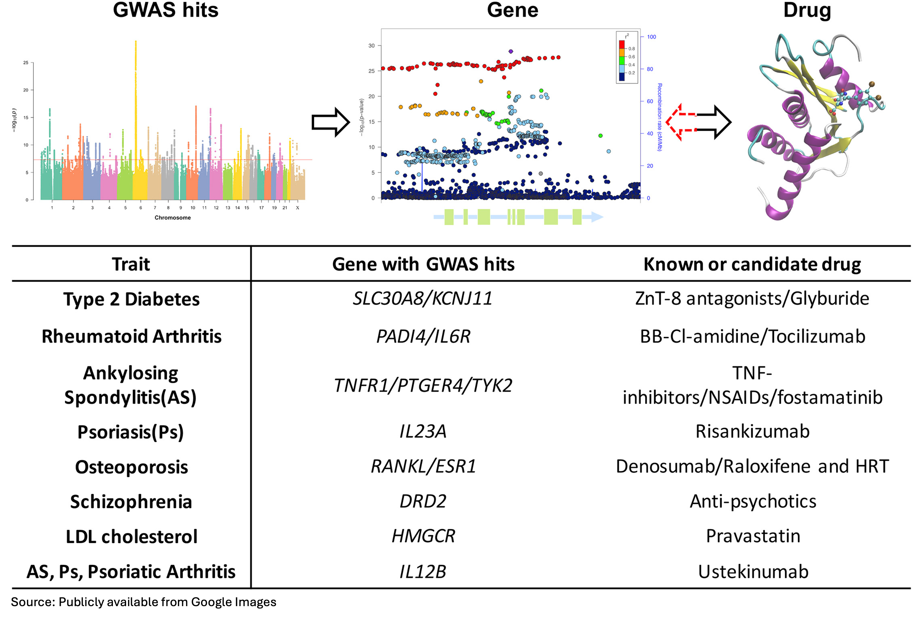


------


# Post-GWAS Analyses


------

# Motivation

- pGWAS (post-GWAS) is a crucial step to move beyond SNP-level associations toward biological mechanism.

- Beyond the basic task of identifying genetic associations, several post-GWAS analyses can be performed:
  1. Fine-mapping: statistical approach to identifying causal variants.
  2. CRISPR experiments: experimental techniques
  3. Polygenic Risk Score (PRS): predicting trait values based on genotype profiles.
  4. Others: colocalization, TWAS, network inference, G×G and G×E analyses, etc.

-----------

<!--

# Genome-wide Significance: It's Not One-Size-Fits-All

- Thresholds depend on LD structure, ancestry diversity, array vs. WES/WGS, imputation panels, and final variant set.
- For **trans-ethnic** analyses, estimate thresholds with population diversity and LD in mind.
- Example suggested thresholds (from 1000 Genomes-based analyses):
  - Africa: $3.24 \times 10^{-8}$
  - Europe: $9.26 \times 10^{-8}$
  - Americas (admixed): $1.83 \times 10^{-7}$
  - East Asia: $1.61 \times 10^{-7}$
  - South Asia: $9.46 \times 10^{-8}$
- A more recent African study proposed $5 \times 10^{-9}$.

---------

# Gene-scoring approach

- First step in many pGWAS pipelines: map SNPs to functional genomic features
  - Coding genes, non-coding RNAs, 5'UTR, 3'UTR, proximal promoters, regulatory elements, enhancers
- Representative SNP $\rightarrow$ gene aggregation tools/methods: 
  - GLOSSI (R package), VEGAS (web \& standalone)
  - ancGWAS: Simes, Smallest, Fisher, Gwbon
  - MAGMA: three methods (one akin to VEGAS)

---------

# Pathway / Sub-Network-Based Approaches


- Complex biological phenomena addressed by GWAS often arise due to **gene interaction** rather than single gene effect.

- Therefore, scientists analyse GWAS based on the **biological network theory** to understand the **disease-causing genes and mechanisms** involved in traits and complex diseases, such as in rare diseases. 

- This approach is based on the results obtained from the gene-based association test and provides a higher level of complexity by considering **biological networks and/or genes ontology**. 

- Analysing GWAS based on biological networks 
  - to capture biological interactions between various molecules such as
proteins, functional DNA motifs, coding and non-coding RNA, as well as disease mechanisms and to consider epigenetic
changes, including methylation states or other modifications (phosphorylation, acetylation, etc).
  - to map genes that are associated with significant SNPs into known pathways/Gene Ontology terms. 

- The result of this approach provides information about the over-represented pathways in a given set of genes/SNPs.

  - 

- Build on gene-based association results; analyze at the pathway/network level.
- Motivation: capture biological interactions (protein-protein, regulatory motifs, ncRNA, epigenetics) and disease mechanisms.
- Typical workflow
  - 1. Map significant SNPs $\rightarrow$ genes (or credible sets $\rightarrow$ genes)
  - 2. Enrich/mine pathways and Gene Ontology (GO) terms
  - 3. Overlay networks (PPI, co-expression) to find sub-networks/modules
- Output: over-represented pathways / modules explaining trait architecture; hypotheses for mechanism and targets.

Speaker notes: Mention that network context can reveal diffuse polygenic signals even when single genes are modest.


Analysing GWAS based on biological networks allows us to capture biological interactions between various molecules such as
proteins, functional DNA motifs, coding and non-coding RNA, as well as disease mechanisms and to consider epigenetic
changes, including methylation states or other modifications (phosphorylation, acetylation, etc). 

Also, this approach aims to map genes that are associated with significant SNPs into known pathways/Gene Ontology terms. The result of this approach provides information about the over-represented pathways in a given set of genes/SNPs.

---------

--->

# Confounding in GWAS -LD

- One major issue is confounding caused by local correlation among sites (linkage disequilibrium), which makes it difficult to distinguish true signal from variants that are merely correlated.

  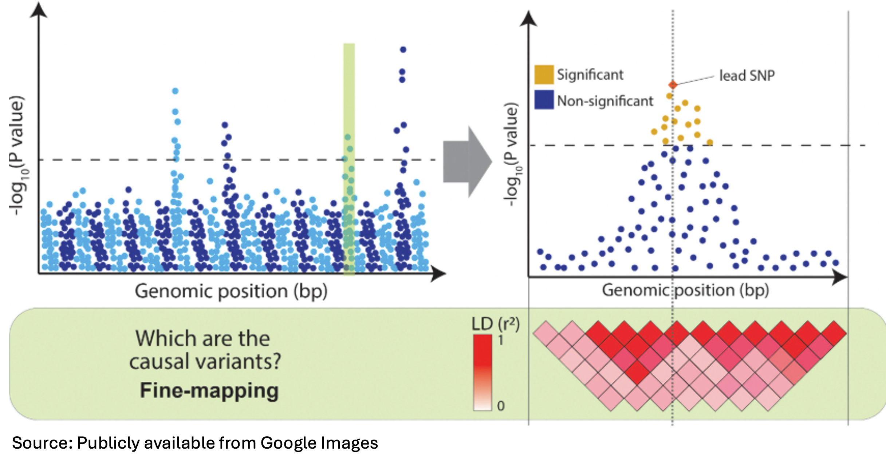

---------
<!--
# Fine-mapping

- Goal: identify causal variants and estimate the number of putative causal variants per locus.
- A central step in establishing causality is to eliminate confounding arising from linkage disequilibrium (LD).
  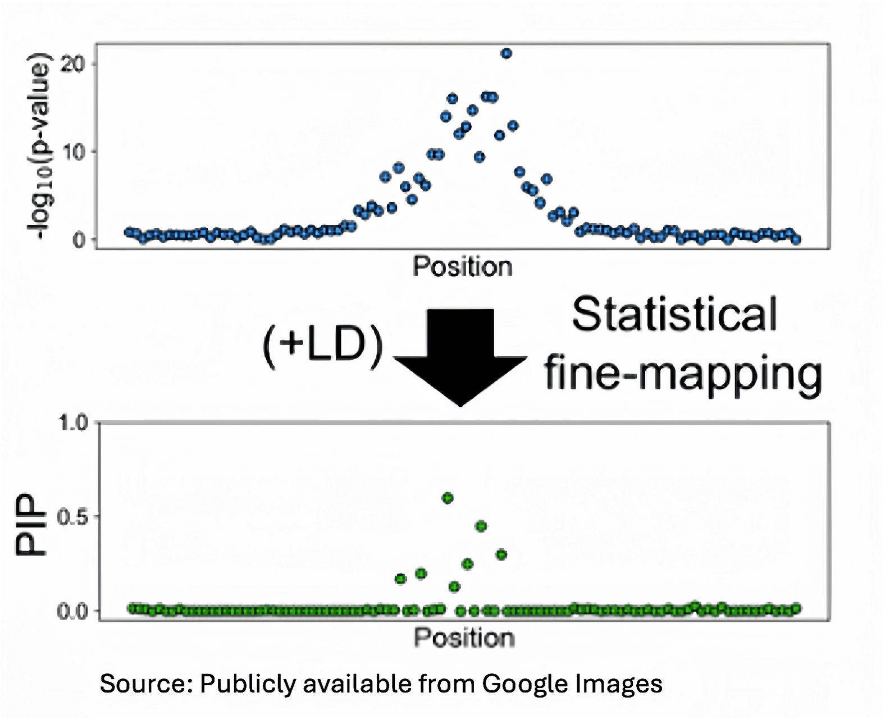
----------
-->

# What is fine-mapping?

- GWAS often identifies a broad locus with many associated SNPs.
- Due to **linkage disequilibrium (LD)**, many SNPs in the locus are correlated
  and show similar p-values.
- Fine-mapping asks:
  - Which SNP(s) in this region are most likely to be **causal**?
  - How many **independent signals** are there?
- Goal: identify specific variants that are the best causal candidates.
- This is a key step before functional follow-up and experimental validation.

----------

# Heuristic fine-mapping: LD-based candidate selection

- Idea: use the **LD pattern around the lead SNP** to pick nearby SNPs
  that are likely to be causal.

- **LD thresholding:**
  - Compute pairwise LD ($r^2$) between the lead SNP and other SNPs.
  - Keep SNPs with LD above a threshold (e.g. $r^2 > 0.6$) as **candidate causal SNPs**.

- **LD clustering :**
  - Hierarchical clustering of all SNPs in a region based on their pairwise $r^2$ to create clusters.
  
  
---------  
  
# Heuristic Fine-mapping: LD-based Candidate Selection

- Visualization tools such as **LocusZoom** or **Haploview**:
    - Combining the GWAS lead SNP with SNPs in the same LD block to select potential causal SNPs. 

  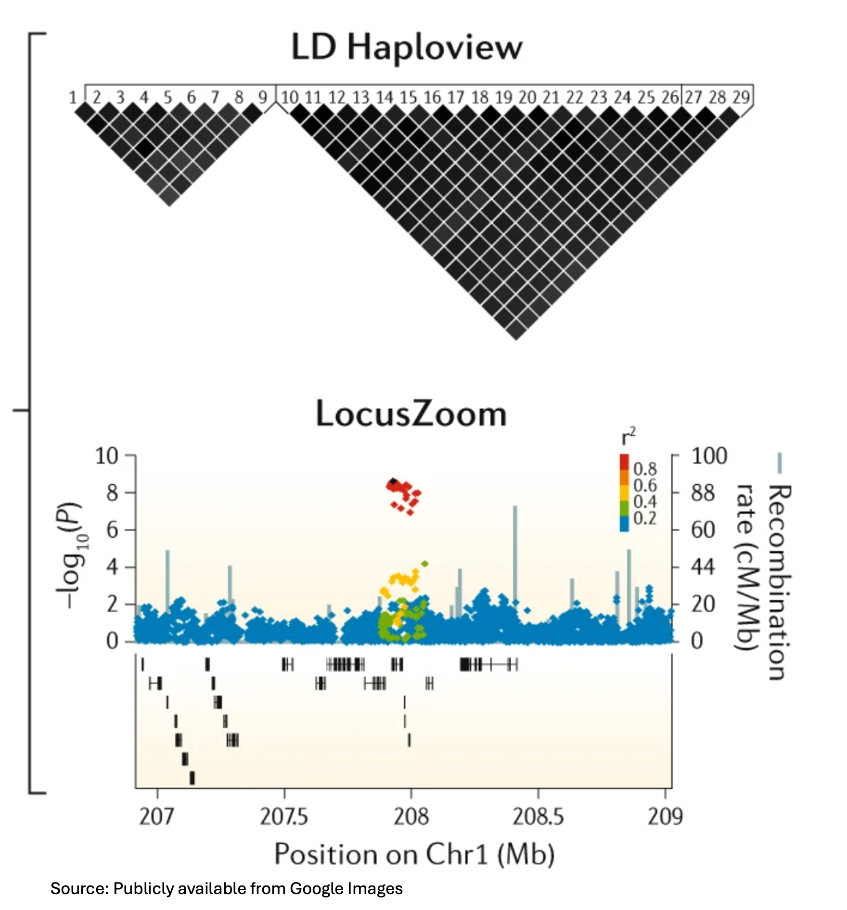

---

# Heuristic Fine-mapping: LD-based Candidate Selection

- Heuristic LD-based methods are useful for **initial candidate selection**, but not sufficient on their own to define causal variants.
- **Limitations:**
  - Relies on **arbitrary thresholds** for LD and window size.
  - Does **not** model the **joint effects** of multiple SNPs on the trait.
  - Does **not** provide an objective measure (e.g. probability) that a SNP
    is causal—interpretation is partly **subjective**.
  - More rigorous approaches (penalized regression, Bayesian fine-mapping)
    explicitly model multiple SNPs together and quantify uncertainty.

---------

# Heuristic Fine-mapping: Conditional Analysis

- Start from the **lead SNP** in a locus (smallest p-value).
- Use **conditional analysis / forward stepwise regression**:
  - Fit a regression model (linear or logistic) with the current set of SNPs
    in the locus (initially just the lead SNP).
  - For each remaining SNP, test its effect **conditional on** the SNPs
    already in the model (add one candidate SNP at a time).
  - Add the SNP with the **smallest conditional p-value** if it is below a
    pre-specified threshold (e.g. $5 \times 10^{-8}$ or a locus-specific threshold).
  - Repeat these steps until **no remaining SNP** has a significant
    conditional p-value → the SNPs in the final model are treated as
    **independent association signals** in the locus.

------

# Heuristic Fine-mapping: Conditional Analysis

- Implemented in tools such as:
  - **PLINK** (e.g. `--condition`, `--condition-list`, stepwise conditional analysis)
  - **GCTA-COJO** (conditional and joint multiple-SNP analysis)
  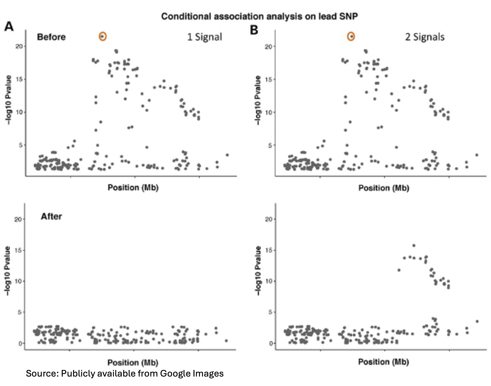
  
  
--------

# Fine-mapping: Penalized Regression Models

- **Jointly model many SNPs** in a region using regression.
- Let $Y$ be the phenotype, $X$ the genotype matrix, and $\beta$ the SNP effects.
- Penalized regression estimates $\beta$ while shrinking small effects towards zero:
  - Examples: **lasso**, **elastic net**, other sparse penalties.
- Objective (elastic net form):
  $$
  \min_{\beta}\; \frac{1}{2n}\|Y - X\beta\|^2
  + \lambda\big(\alpha\|\beta\|_1 + (1-\alpha)\|\beta\|_2^2\big).
  $$
- Result: a sparse model where only a few SNPs have non-zero effects → candidate causal SNPs.

---

# Fine-mapping: Penalized Regression Models

- Works best with **individual-level data** and many correlated SNPs.
- **Tuning parameter** $\lambda$ (and $\alpha$) chosen by cross-validation to minimize prediction error.
- Advantages over forward selection:
  - More stable when SNPs are highly correlated.
  - Simultaneously estimates effect sizes and performs variable selection.
- Limitations:
  - Aims to choose a good model for $Y$, not to quantify causal probabilities.
  - This motivates Bayesian variable selection / Bayesian fine-mapping.

---

# Ingredients of Bayesian inference

- We have an unknown quantity $\theta$:
  - e.g. effect size, or an indicator “SNP $j$ is causal”.
- **Prior** $p(\theta)$:
  - Our belief about $\theta$ *before* seeing the data.
- **Likelihood** $p(\text{data} \mid \theta)$:
  - How likely the observed data are, if $\theta$ had a given value.
- **Posterior** $p(\theta \mid \text{data})$:
  - Our updated belief about $\theta$ *after* seeing the data.
- Bayes’ rule:
  $$
  p(\theta \mid \text{data}) =
  \frac{p(\text{data} \mid \theta)\, p(\theta)}{p(\text{data})}
  \;\propto\; p(\text{data} \mid \theta)\, p(\theta).
  $$

---

# Bayesian fine-mapping: big picture

- Same goal as penalized regression: decide **which SNPs have non-zero effects**.
- Key difference: Bayesian methods assign **probabilities to many models**, not just pick one best model.
- We specify a **prior** over which SNPs are causal (e.g. all equally likely, or a fixed expected number per region) and update it with the data using Bayes’ rule.
- Output:
  - **Posterior probabilities** for different models (combinations of causal SNPs),
  - **Posterior inclusion probabilities (PIPs)** for each SNP.
- This gives a clear **probabilistic interpretation** of fine-mapping results.

-----

# Bayesian Fine-mapping

- For $m$ SNPs, define an indicator vector $c = (c_1,\dots,c_m)$:
  - $c_j = 1$ if SNP $j$ is causal, $c_j = 0$ otherwise.
  - There are $2^m$ possible $c$ vectors → $2^m$ possible causal models.
  
- Using Bayes' formula, for a specified model $M_{\mathrm{c}}$:

$$
P(M_{c} \mid D)=\frac{P(D \mid M_{c}) \cdot P(M_{c})}{P(D)}
$$

- The posterior probabilities for different models can be used to determine the posterior probability of including each SNP in any of the models (PIP).


------
  
# Posterior Inclusion Probability (PIP)

- PIP for SNP $i$: sum of posteriors over all models that include SNP $i$ as causal.

$$P I P_i=\sum_c I(~\text{model containing SNP i as causal}~) P(M_{c} \mid D)$$

- Use PIP ranks to prioritize putative causal variants.

- Caution in high-LD regions: probability spreads across correlated SNPs.

- Posterior expected number of causal SNPs $\approx \Sigma PIP_{i}$ over the region.

-------


# Credible Sets

- "A level $\rho$ credible set is defined to be a subset of correlated variables (with correlation within the set greater than some threshold $r$ ) that has probability $\rho$ or greater of containing at least one effect variable (i.e. causal SNP)."

- In short, it defines a set of variants likely to contain the causal SNP(s).

- Procedure:
  1. Rank SNPs by PIP (largest $\rightarrow$ smallest).
  2. Accumulate PIPs until reaching coverage a (e.g., $95 \%$ or $99 \%$ ).
  3. Selected variants form the a credible set.
  
#### Question: Are credible sets unique for a given level $\rho$?

--------

# Discussion

- Answer: Not necessarily. 
- Ties or near-ties in PIPs can yield multiple valid sets; software typically reports one (often the smallest) based on its ranking rules.
  
  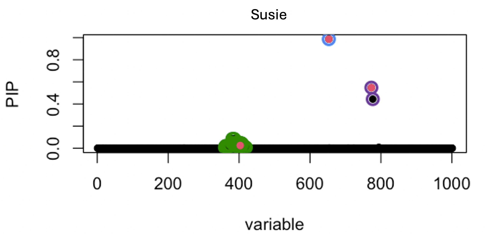

-------
<!--
# Functional Annotation in Fine-Mapping

- Bayesian models can incorporate additional knowledge (e.g. functional annotation) in terms of prior to help disentangle highly correlated variables.

  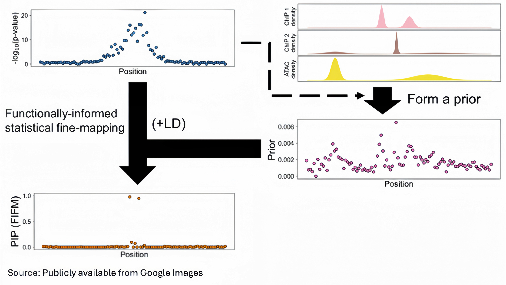


-----

# Functional Annotation in Fine-Mapping

  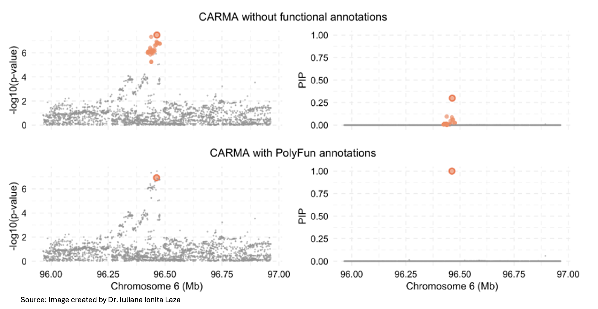
  
------

--->

# Practical Workflow \& Tools

- Typical inputs: GWAS summary statistics, ancestry-matched LD reference panels, and (optionally) functional annotations.
- Steps:
  - Define regions (around lead SNPs; PLINK --clump for sentinel signals).
  - Run Bayesian fine-mapping to obtain PIPs \& credible sets.
  - Outputs to show: top-PIP variants, credible set sizes, locus zoom-style plots.
- Tools: CAVIAR, FINEMAP, SuSiE, CARMA

--------

# Hypothetical Examples

- The purple bars represent additional variant-level statistics produced by fine-mapping.
   - β-values for penalized regression
   - PIPs for Bayesian methods 

- The light grey boxes represent the regions selected by fine-mapping.

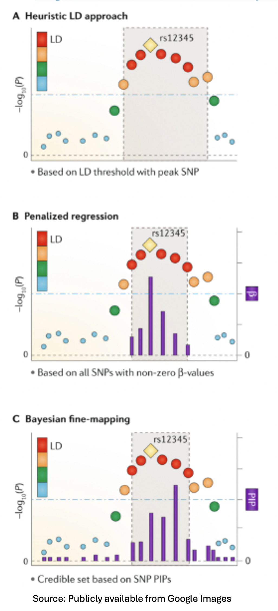


-------

# More Complex Issues

- Many GWAS results come from meta-analyses without individual-level data.

- Sample size varies by SNP in the meta-analysis, leading to inconsistencies.

- LD information is often taken from external reference panels.

- Mismatches between external LD and GWAS summary stats can invalidate fine-mapping.

- Leverage high-dimensional functional annotations to improve inference.

<!--
- ##### We’ll dive deeper into fine-mapping strategies for these scenarios in the Advanced Computational Genomics course!
-->

---------

# Fine-mapping methods: summary

- **Heuristic LD-based methods**
  - Use LD thresholds and visual inspection to pick SNPs near lead SNPs.
  - Fast and intuitive, but arbitrary and non-probabilistic.

- **Penalized regression**
  - Jointly models many SNPs, encourages sparse solutions.
  - Better than simple forward selection in high-LD regions.

- **Bayesian fine-mapping**
  - Models uncertainty over many possible causal configurations.
  - Produces PIPs and credible sets → probabilistic interpretation.

--------

# Functional Follow-up

- Fine-mapping prioritizes putative causal variants at GWAS loci that can be subjected to functional studies.
- Massively parallel CRISPR perturbation of GWAS loci:

  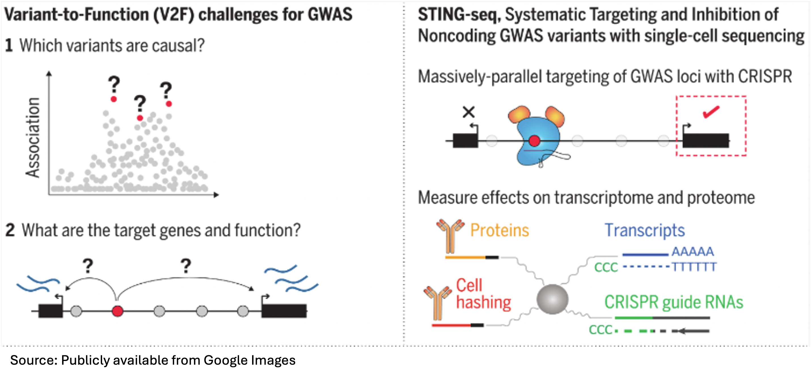

-------


# What's Next

<!--
- In the Advanced Computational Genomics course: we’ll dive deeper into annotation types and resources.
-->

- Next lecture:

  - Functional Annotation
  - Colocalization analysis
  
### What questions do you have about anything from today?

