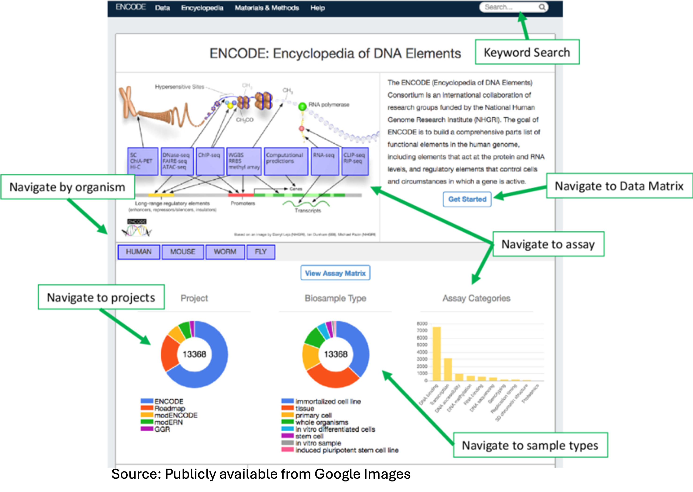
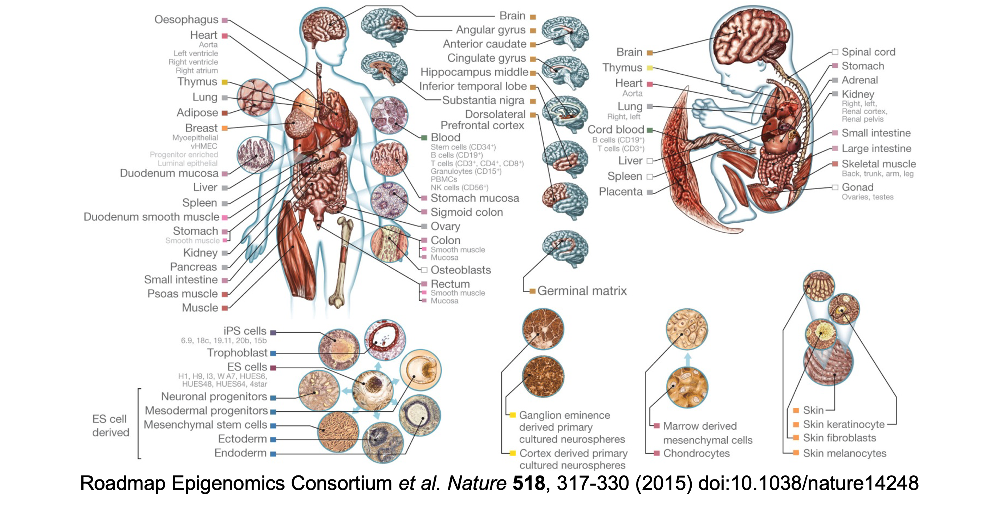
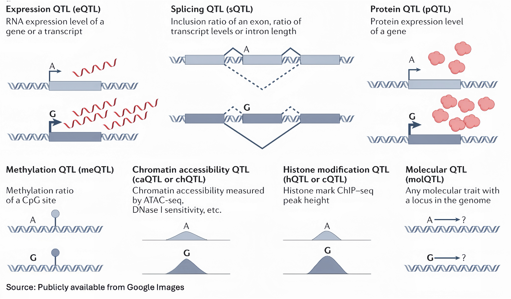
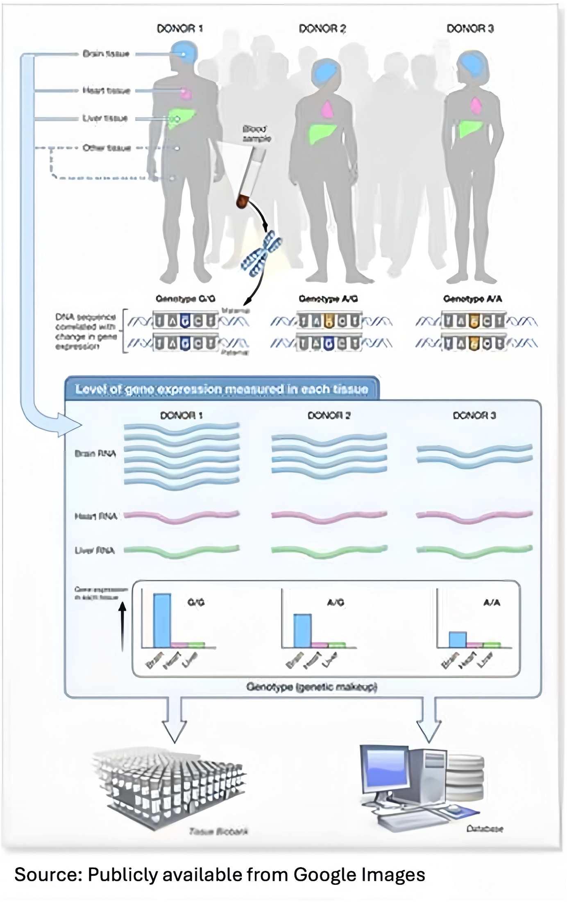
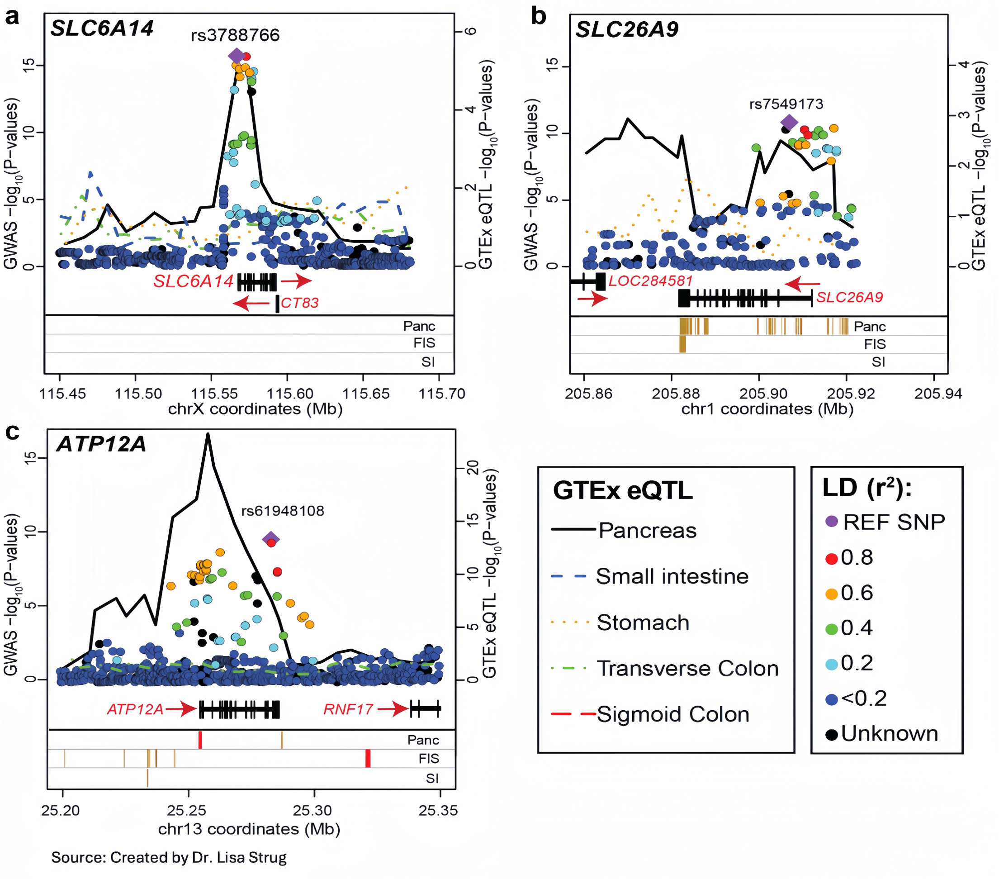
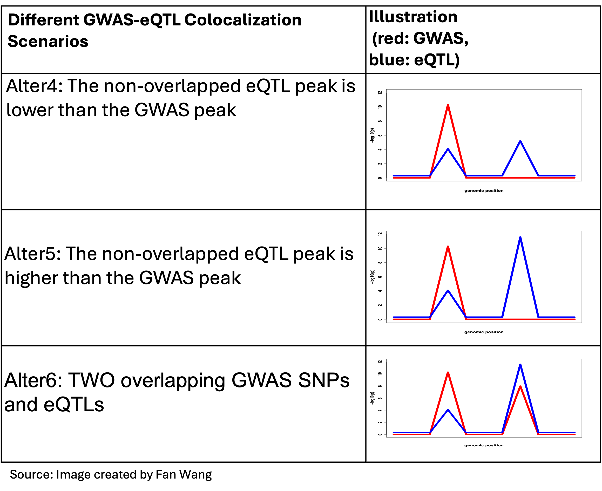
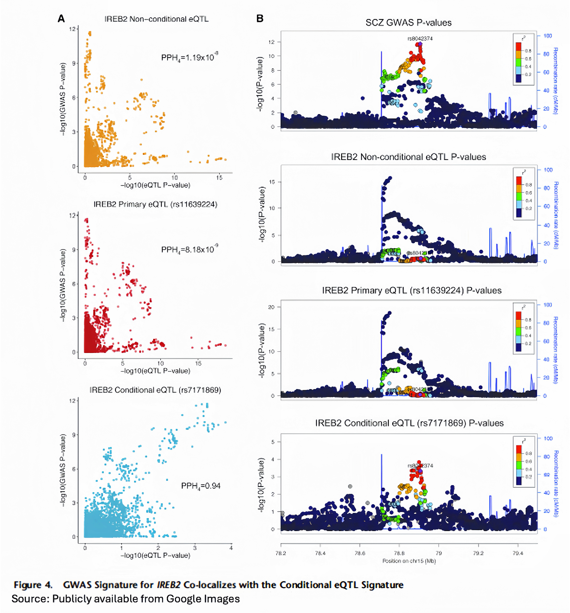
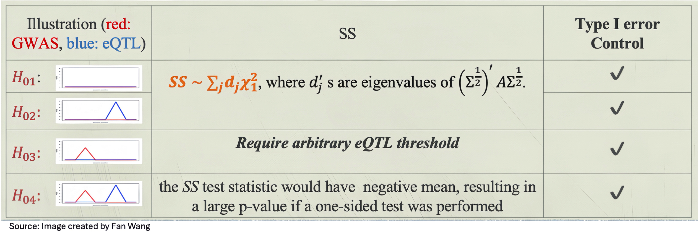
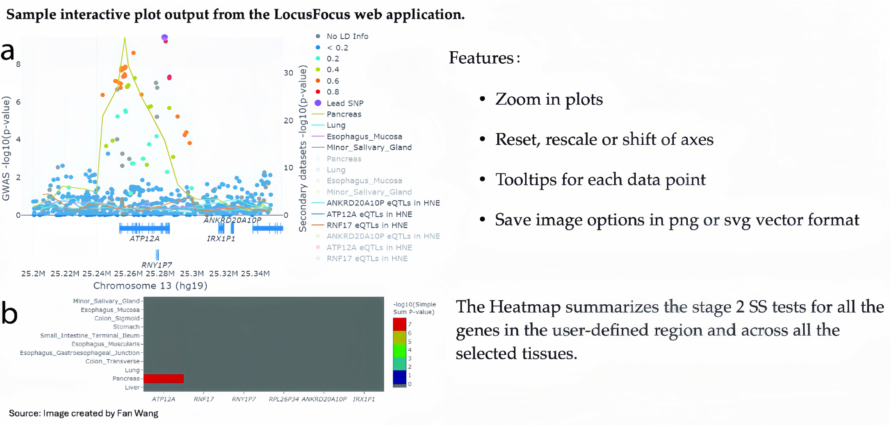

# Post-GWAS Analyses II

```
$ echo "Data Sciences Institute"
```

-----

# What You Will Learn Today

- Functional annotation primer: ENCODE, Roadmap, GTEx and molecular QTLs.
- How to integrate GWAS with eQTL and other functional data (colocalization frameworks).
- Key tools and workflows: COLOC, Simple Sum, LocusFocus.
- Hands-on perspective: 
  using web tools (e.g. LocusFocus) to visualize GWAS + eQTL signals and perform practical colocalization analysis.

<!--


# Effect Allele Consistency 

- As datasets for PRS come from different GWAS experiments, it is critical to ensure consistency.

- Datasets vary in allele coding (e.g., REF/ALT, A1/A2, effect/other, Illumina TOP/BOTTOM, HapMap forward, PLINK $1 / 2$, Affy A/B).

- The effect allele must match between summary stats and target data to avoid sign errors.

- Action: read dataset docs, harmonize strands, and confirm effect-allele labeling before scoring.


--------

# SNP-level QC for PRS

- The QC assessment at the SNP level is crucial to avoid misleading PRS. 
- SNPs level errors include
  - mismatching SNPs (inconsistent SNPs due to position difference in genomic position or nucleotide type)
  - existence of duplicate SNP
  - Ambiguous SNPs (researchers have no idea about SNP strand: C/G or A/T)
  - missing alleles

- Higher values of heritability indicate that the phenotype is explained best by the genotype. 

- Recommend heritability >0.5 to perform PRS analysis.

- To estimate heritability, researchers should use LD score regression that could be used to distinguish polygenicity (SNPs effects) and confounding biases, including cryptic relatedness and population stratification.

# Colocalization Analysis

- Colocalization integrates functional annotations with GWAS results to test whether the same causal variant(s) underlie multiple association signals.

- Annotation/QTL resources typically include:
  - gene expression (eQTLs), protein expression (pQTLs), exon splicing (sQTLs), DNA methylation (mQTLs)
  - chromatin acetylation and chromatin accessibility (caQTLs)
  
- Both parametric and non‑parametric strategies are used.

- Common ideas:
  - Model **shared** vs. **distinct** causal variants across two traits/datasets.
  - Use summary statistics and LD to compute posterior support or test statistics for colocalization.
  
- Outputs typically include posterior probabilities for hypotheses (e.g., shared causal variant) or calibrated test p-values.
-->
-------


# Functional Annotation

-------


# Functional Annotation of variants

- GWAS pinpoints where associations occur, but not how the implicated variants exert their effects.
- Functional annotation adds biological context to a variant to infer its potential impact on genes, regulatory programs, and molecular traits.
- Use diverse resources to answer specific questions:
  - Does the variant alter amino-acid sequence or function? (e.g. PolyPhen-2)
  - Does the variant fall within an enhancer, promoter, or other regulatory element? (ENCODE, Roadmap Epigenomics)
  - Is it in a conserved region? (evolutionary constraint)
  - Does it affect a molecular trait like gene expression or protein level? (eQTL / pQTL)
  
<!--
Notes:
Before we get into the specific datasets, I want to make sure we’re all on the same page about what functional annotation means. When we do GWAS or when we sequence people, we get a list of variants. That tells us where the variation is in the genome, but it doesn’t tell us what that variant actually does.

Functional annotation is the step where we add biological information back onto each variant to guess or infer its impact. In other words, we’re enriching a bare variant call with evidence from biology.

So what kinds of questions do we ask? First, does this variant change the protein? For coding variants we can use tools like PolyPhen-2 that tell us whether an amino-acid change is likely damaging.
Second, does the variant fall in a regulatory element? For noncoding variants we look at ENCODE or Roadmap epigenomics to see whether that position is an enhancer or promoter in some cell type.
Third, is the position evolutionarily conserved? If that base is preserved across many species, that’s a hint that changing it might matter.
And finally, does the variant actually change a molecular trait in people? That’s where things like eQTLs or pQTLs come in — they tell us that different genotypes at this site lead to different expression or protein levels.

The overall goal of doing all this is not just to decorate the variant — it’s to prioritize which variants are worth following up in experiments later.
-->

--------

# ENCODE

The Encyclopedia of DNA Elements (ENCODE) is a public research project that aims to build a comprehensive parts list of functional elements in the human genome.
    


--------

# Roadmap Epigenomics

- "The NIH Roadmap Epigenomics Mapping Consortium was launched with the goal of producing a public resource of human epigenomic data to catalyze basic biology and disease-oriented research."
- Coverage: 127 tissues/cell types (Roadmap and ENCODE) with coordinated measurements of histone marks, DNA methylation, open chromatin, and TF binding.

-------

# Roadmap Epigenomics

   

--------

# Molecular QTLs 


- Using molecular QTLs together lets us build a causal chain from variant → molecular effect → phenotype.

  

-------

# GTEx

- Genotype-Tissue Expression project (GTEx) links genotype to expression across tissues.
- Collected DNA and RNA from many human donors, multiple tissues per person.
- For each variant: test whether different genotypes show different gene-expression levels in a tissue.
  
  

---------

# Colocalization Analyses


---------
# Genetic Association Analysis - Review

 $$
g\left\{E\left[\left(\begin{array}{c}
y_1 \\
y_2 \\
\vdots \\
y_n
\end{array}\right)\right]\right\}=\left(\begin{array}{c}
g_{1, j} \\
g_{2, j} \\
\vdots \\
g_{n, j}
\end{array}\right) \beta_j+\left(\begin{array}{ccc}
x_{1,1} & \cdots & x_{1, q} \\
\vdots & \ddots & \vdots \\
x_{n, 1} & \cdots & x_{n, q}
\end{array}\right)\left(\begin{array}{c}
\gamma_1 \\
\gamma_2 \\
\vdots \\
\gamma_q
\end{array}\right)
$$

- $y_i$ : phenotype for $i^{\text {th }}$ individual
- $g_{i, j}$ : genotype for $i^{\text {th }}$ individual at $j^{\text {th }}$ SNP; $g_{i j}=0,1$ or 2
- $x_{i, j}$ : other covariates
- Repeat the regression analysis ( $H_0: \beta_j=0$ ) for $j=1,2, \ldots, M$. 
  $\rightarrow$ GWAS summary statistics: $Z=\left(Z_1, Z_2, \ldots Z_m\right)$.


----------

# Expression Quantitative Trait Loci (eQTL)

  


eQTL study:
 - $y_i$ : (normalized) gene expression (for a particular gene and tissue)
 - eQTL summary statistics: $T=\left(T_1, T_2, \ldots T_m\right)$


----------

# Visualizing GWAS and eQTLs

  


- We want to test whether eQTL p-values and GWAS p-values have similar/overlapping pattern at the set of same SNPs $\rightarrow$ Colocalization analysis


-------

# Visualizing GWAS and eQTLs


  


--------

# Composite Null Hypothesis


  


-------

# Composite Null Hypothesis


  


-------

# Challenges

  


-------

# Exercise: Colocalization vs LD

Consider a locus where:
- GWAS identifies a strong association with type 2 diabetes (lead SNP: A).
- An eQTL study in pancreatic islets finds a strong association with expression
  of gene X in the same region, but the lead eQTL SNP is different (lead SNP: B).

Question:
1. Why might the lead GWAS SNP and the lead eQTL SNP be different
   even if there is a shared causal variant?

---------

# Methods to Integrate GWAS and eQTL Data

- **Bayesian approaches** aim to identify shared causal variants contributes to both the disease outcome and gene expression variation.
  - **COLOC , eCAVIAR, GWAS-PW**.etc.
- **Frequentist-based methods:**
- Methods that impute gene expression based on a reference, and then associate imputed expression with the trait:
  - **PrediXcan and TWAS**
- Integration methods based on Mendelian randomization:
  - **SMR, SMR-multi**, etc.
- Overlapping pattern:
  - **Simple Sum2**


------

# COLOC


- Calculates posterior probability for 5 cases (from H0 to H4)
  $$
  P\left(H_h \mid D\right) \propto \sum_{S \in S_h} P(D \mid S) P(S)
  $$


  


- Prior probabilities: Set at SNP level - typically $\mathrm{P}_1=P_2=10^{-4}$ for association with one trait, and $P_{12}=10^{-6}$ for colocalization (shared association).


-------
# Extension of COLOC

- GWAS-PW (Pickrell et al. 2016):
  - Extends COLOC by empirically estimating priors from the genome-wide data for the five hypotheses.
  - Incorporates sample relatedness
  
  
- COLOC2 (Dobbyn et al. 2017):
  - Uses estimated proportions in GWAS-PW as priors (or optionally, coloc default or user-specified priors) in the calculation of the posterior probability.
  - For a locus with multiple independent eQTL signals, adopting **a forward stepwise conditional analysis for the eQTL study**.
  - For a gene with $k$ independent eQTLs, they run $k$ colocalization models.

------


# Application

- GWAS signature for IREB2 Colocalizes with the Conditional eQTL signature.


  
  
------

# Pros and Cons of COLOC2

- Advantages:
  - Quick computation by Approximate Bayes Factor without iterative computation scheme (such as Markov Chain Monte Carlo) is required.
  - Distinguished evidence for non-colocalization.(H0-H4)

- Limitations:
  - Single-causal-variant assumption per trait within the region (can mislead in polygenic/allelic-heterogeneity settings).
  - Conditional analysis can be costly when extending to multiple signals or larger regions.


--------

# SuSiE-COLOC

- SuSiE is a fine-mapping framework to distinguish multiple signals for a given trait, and is more computationally efficient than the forward stepwise conditional analysis.
- SuSiE outputs a $95 \%$ credible set selecting a subset of L signals with inferred causal SNPs.
- If $L_1$ and $L_2$ signals are selected for trait1 and trait2, respectively, we run COLOC $L_1 \times L_2$ times on all possible pairs of signals between the traits.

---------

# ECAVIAR
(Hormozdiari et al. 2016)

- Simultaneously performing fine-mapping for GWAS and eQTL studies by considering almost all combinations of causal status between SNPs
- Estimate the posterior probability that the same variant is causal in both studies :

$$
\mathrm{P}\left(c_i^{(\mathrm{p})}=1, c_i^{(\mathrm{e})}=1 \mid S^{(\mathrm{p})}, S^{(\mathrm{e})}\right)=\mathrm{P}\left(c_i^{(\mathrm{p})}=1 \mid S^{(\mathrm{p})}\right) \times \mathrm{P}\left(c_i^{(\mathrm{e})}=1 \mid S^{(\mathrm{e})}\right).
$$

  - $c_i^{(p)}$ and $c_i^{(e)}$: indicator that SNP $i$ is causal in the GWAS (phenotype) study and eQTL study, respectively.
  - $S^{(p)}$ and $S^{(e)}$ : vector of $Z$-scores from the GWAS and eQTL study, respectively. 

-------

# Pros and Cons of ECAVIAR

Advantage:
- Higher true positive rate compared to COLOC when multiple variants are causal in a locus with low LD.

Limitations:
- Computation can be very long when number of SNPs is huge
- Imposes an assumption on the maximum number of causal SNPs in a locus (six)
- The posterior probability of colocalization will be averaged across several variants in high LD, resulting in ambiguous colocalization conclusions.


-------

# Extensions to Multi-Trait Colocalization

- **Moloc** evaluates all possible configurations of shared vs. distinct causal variants across traits.
  - Computationally intense: number of configurations $=2^T-1$ (for T traits)
  - Good when you want explicit posterior probabilities for all trait-sharing scenarios
- **Hyprcoloc** uses a greedy algorithm to group traits that share a causal variant.
  - Prioritizes traits that colocalize strongly first, then expands to others
  - Hyprcoloc is suited for large numbers of traits (e.g., >10).


------

# Further Issues

- eCAVIAR evaluates multiple causal configurations but is computationally intensive with many SNPs.
- SuSiE-COLOC reduces complexity but still requires $\mathrm{L}_1 \times \mathrm{L}_2$ coloc runs.
- Reduced power when there is high LD
- Few formal corrections for multiple hypotheses across loci.
- Posterior probabilities (e.g., PPH4) must be interpreted with caution in genome-wide scans.
- Adjusting priors using false positive report probability (FPRP) to control for multiple testing.


------

# Simple Sum

- A frequentist integration method that combines GWAS and eQTL signals within a locus.
- Particularly powerful in regions with high LD and allelic heterogeneity (multiple causal variants).
- The extension Simple Sum 2 (SS2) is designed to control type I error under a composite null, correct for multiple testing, and handle meta-analysis / sample relatedness.

--------
  
# Chi-square ($\chi^2$) Distribution: Quick Review

- Fact from probability: if $Z \sim N(0,1)$, then **$Z^2 \sim \chi^2_1$**.
- Consider **independent** $Z_1, \dots, Z_k \sim N(0,1)$.
  - Define a statistic $S = \sum_{j=1}^k Z_j^2$.
  - Then $S \sim \chi^2_k$, a chi-square distribution with **$k$ degrees of freedom**.
- In practice, SNP Z-scores within a locus are **correlated** because of LD.

------

# Weighted $\chi^2$ Distributions: Quick Review

- Let $Z = (Z_1,\dots,Z_k)^\top \sim N(0,\Sigma)$, where $\Sigma$ is the LD (correlation) matrix.

- Consider the statistic $S = \sum_{j=1}^k Z_j^2.$
 
- Using the eigenvalues $f_1,\dots,f_k$ of the LD matrix $\Sigma$, we can write
  $$
  S \;\overset{d}{\approx}\; \sum_{j=1}^k f_j \chi^2_{1,j},
  $$
  a **weighted sum of independent $\chi^2_1$ variables**.

- Intuition: each eigenvalue $f_j$ represents how much variation comes
  from one “independent direction” of the LD structure; larger $f_j$
  give more weight in the sum.
---------

# Quadratic Forms: Quick Review

- Many region- or gene-level test statistics can be written as a **quadratic form**  
    $S = \sum_{i} a_{i,j}Z_{i}Z_{j}=Z^\top A Z$, for some symmetric matrix $A$ (e.g. weights on SNPs).
  - For example, $A=I$. 
  
- In practice, software computes the eigenvalues and then uses this weighted $\chi^2$ distribution to obtain the **p-value** under the null (i.e., $Z \sim N(0,\Sigma)$):
  $$
  S = Z^\top A Z \;\overset{d}{\approx}\; \sum_{j=1}^m d_j \chi^2_{1,j}.
  $$
- $T$ behaves like a **weighted sum of independent $\chi^2_{1}$ variables**,  with weights are the eigenvalues $d_j$ of matrix $\Sigma^{1/2} A \Sigma^{1/2}$.
---

# Simple Sum 

[Gong*, Wang*, Xiao*, et al., 2019. PLOS Genetics.]
- Dichotomized eQTL evidence (threshold $\tau$ ):
  $$
  S S=\frac{1}{\sum_{j=1}^m I\left(\left|T_j\right| \geq \tau\right)} \sum_{j=1}^m Z_j^2 I\left(\left|T_j\right| \geq \tau\right)-\frac{1}{\sum_{j=1}^m I\left(\left|T_j\right|<\tau\right)} \sum_{j=1}^m Z_j^2 I\left(\left|T_j\right|<\tau\right)
  $$
  
  
--------  

# Simple Sum 

- $\boldsymbol{S S}=\sum_{\boldsymbol{j}} Z_j^2\left[\frac{\boldsymbol{T}_{\boldsymbol{j}}^2-\frac{\sum_{\boldsymbol{j}} \boldsymbol{T}_{\boldsymbol{j}}^2}{\boldsymbol{m}}}{\left(\sum_{\boldsymbol{j}} \boldsymbol{T}_{\boldsymbol{j}}^2-\frac{\sum_{\boldsymbol{j}} \boldsymbol{T}_{\boldsymbol{j}}^2}{\boldsymbol{m}}\right)^2}\right]=Z^{\prime} \boldsymbol{A} Z, ~ A=\operatorname{diag}\left(a_j\right), a_j=\left[\frac{T_j^2-\frac{\sum_j T_j^2}{m}}{\left(\sum_j T_j^2-\frac{\sum_j T_j^2}{m}\right)^2}\right].$


  

--------


# Simple Sum 2

- Stage 1: Formally test eQTLs by $\sum_{j=1}^m T_j^2$.

- Under the null of no eQTLs ( $H_{01}$ and $H_{03}$ ), $\sum_{j=1}^m T_j^2 \sim \sum_{j=1}^m f_j \chi_1^2$, where $f_j^{\prime} s$ are the eigenvalues of $\Sigma$ (LD matrix).

- Stage 2: Perform the Simple Sum test $\sum_j Z_j^2\left[\frac{T_j^2-\frac{\sum_j T_j^2}{m}}{\left(\sum_j T_j^2-\frac{\sum_j T_j^2}{m}\right)^2}\right]$.

- The type I error rate for a single test under composite null hypothesis is controlled at $\alpha$.
- Bounded by the maximum type $I$ error rates for the stage 1 and the stage 2 test.

-------


# Complex Data Scenarios

- Many gene-tissue tests: extend to multiple gene-tissue pairs and control the family-wise error rate (FWER) across tests (e.g., Bonferroni correction).
- Meta-analysis with related individuals: combine sub-studies by modeling the covariance of SS2 test statistics to account for relatedness.
- Sample overlap: explicitly account for overlap/relatedness between GWAS and eQTL cohorts, adjusting cross-study correlations when performing inference.


--------

# LocusFocus 

(https://locusfocus.research.sickkids.ca/)

- SS2 is implemented in this web-based tool, which enables integration of GWAS summary statistics with any secondary SNP-level dataset such as eQTL, mQTL, or other phenotypic associations from GWAS. 

- The tool is developed to **conduct set/gene-based testing, colocalization analysis** and **visualization of signals**.

- The eQTL summary statistics from GTEx V8 are made available for selection within the web server to test colocalization with tissues and genes. 

- COLOC2 colocalization testing is also available.

---------

# LocusFocus Input


  
  
------

# LocusFocus Output

  
  
---------


# [Demo of LocusFocus](https://locusfocus.research.sickkids.ca/) 


---------

# Discussion: What can colocalization tell us (and not tell us)?

- Suppose colocalization analysis suggests a shared signal between a GWAS trait
  and an eQTL for gene X in a relevant tissue.

Questions:
1. What are **limitations** of relying only on colocalization to infer causality?
2. What additional data or analyses would you want before declaring gene X causal?

-----------

# What's Next


- Next lecture:

  - PheWAS \& Biobanks
  - Risk Prediction
  
### What questions do you have about anything from today?

