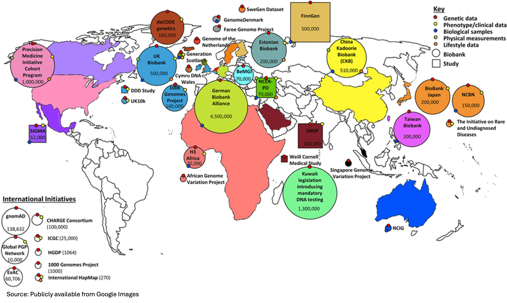
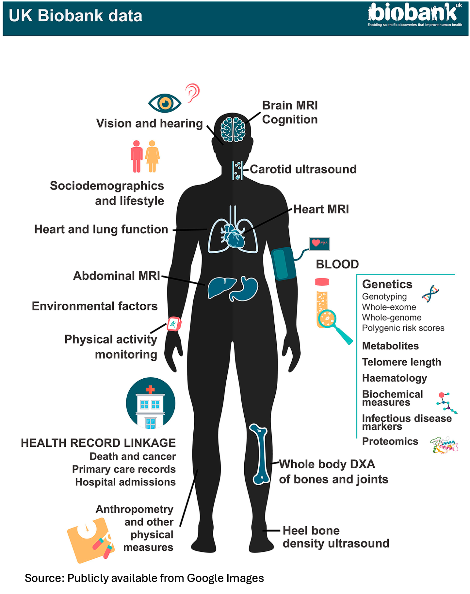
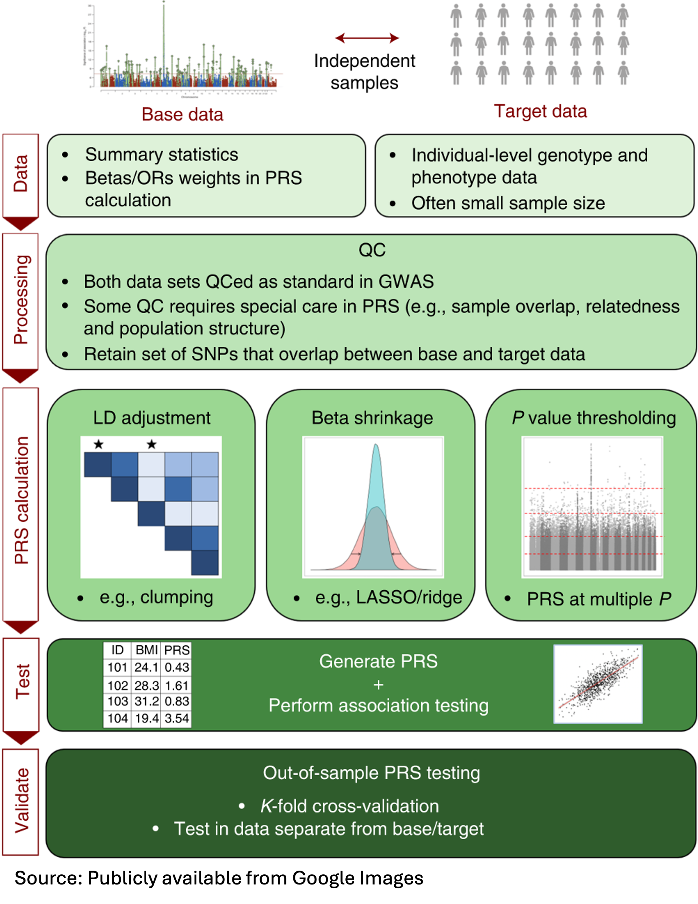
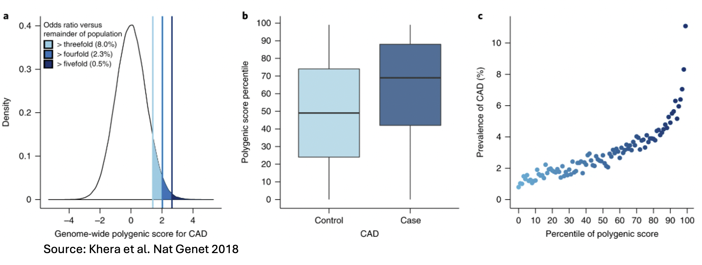
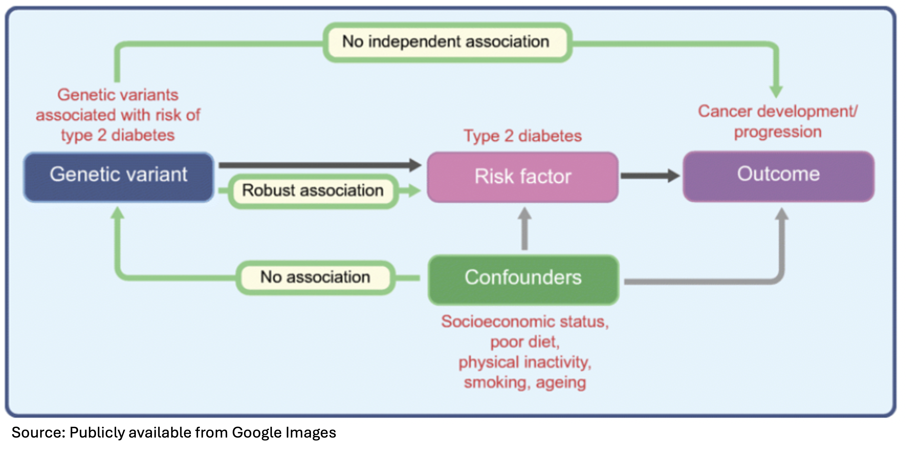
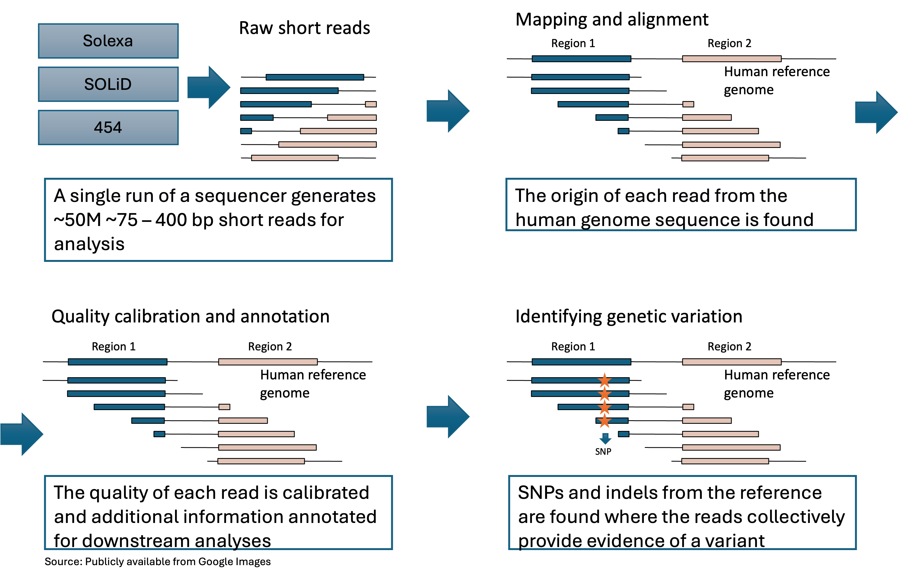

# Post-GWAS Analyses III

```
$ echo "Data Sciences Institute"
```

-----

# What You Will Learn Today

- The concept and basic science of polygenic risk scores (PRS)    
- PheWAS, pleiotropy, and biobanks
- An introduction to rare variation and sequencing-based studies  

------

# Multiple Phenotypes (Pleiotropy \& Multi-trait GWAS)

- Classic GWAS: single-variant $\times$ single-phenotype tests.
- Pleiotropy-one gene influencing multiple phenotypes-is common in complex traits.

- Integrating summary statistics across phenotypes can boost power to detect associations between a gene/variant and correlated traits.
- Approaches that combine dependent $p$-values or explicitly model genetic correlation to test multi-trait association include:
  - MTAG (Multi-Trait Analysis of GWAS), CPASSOC (cross-phenotype association), among others.

-------


# Biobanks

- Biobanks collect information and samples from millions of people, so new studies are possible without recruiting subjects.
  

--------

# UK Biobank

- The UK biobank collects detailed information about individuals, their health and environment in a standardized way.
  
  

-----

# PheWAS \& Biobanks

- Biobanks enable phenome-wide association studies (PheWAS), which test many phenotypes against a single genetic variant-the reverse of GWAS.

- **Why PheWAS**:
  - PheWAS can help replicate known associations and discover new ones.
  - PheWAS is useful for repurposing existing drugs and identifying potential side effects.

------

# Pleiotropy Results from a PheWAS Study 

- One SNP is tested for association with 1,358 phenotypes, using logistic regression assuming an additive genetic model adjusted for age, sex, study site and the first three principal components. 
  


-------


# Risk Prediction


--------

# Risk Prediction

- Goal: estimate the probability that a person will develop a disease.
- Important for disease early detection and prevention.
- Clinical risk prediction is usually determined by 
  - Demographics: age, sex, ancestry.
  - Clinical / biomarker data: blood pressure, lipids, lab values.
  - Environment: pollution, toxins, occupational exposures. 
  - Lifestyle: BMI, smoking, alcohol, physical activity.
  - Genetic data: historically underused in standard clinics.

--------

# Genetics as a Source of Risk

- Most variants for common diseases have small individual effects.
- A few variants have large effects.
  - E.g. In breast cancer, mutations in BRCA1 and BRCA2 confer high absolute risks (about $65 \%$ and $45 \%$, respectively) and account for $\sim 5 \%$ of all cases.
- Individuals carrying these high-risk variants can benefit from more intensive screening and, in some cases, preventive interventions.

-------

# Polygenic predictions of disease risk

- The polygenic nature of complex traits means that many genetic variants of small effects are associated with disease risk.
- GWAS scan the genome and identify many risk-increasing or risk-decreasing alleles.
- Each allele shifts risk by a tiny amount.
- If we add up the effects of many such alleles, the total can become informative.
- This sum is what we call a **polygenic risk score (PRS)**.
- Polygenic Risk Score (PRS) aggregates effects across a large set of SNPs (causal or tag).

----------

# PRS Calculation 


- Assume we have $p$ variants in a GWAS study.
- Two ingredients needed:
  1. Discovery sample
  2. Target (independent) samples

- Let $\hat{\beta}_1, \ldots, \hat{\beta}_p$ be the estimated effects based on the discovery dataset.

- Let $X_{i 1}, \ldots, X_{i p}$ be the number of minor alleles for the $p$ variants and individual $i$ in the target/independent sample. Then the polygenic risk score (PRS) for individual $i$ is defined as:

$$
P R S_i=\sum_{j=1}^p X_{i j} \hat{\beta}_j I\left(\hat{\beta}_j>c\right) .
$$

--------

# Existing PRS methods

- Simple approaches: Clumping + Thresholding (e.g., PRSice)
- Bayesian methods: LDpred / LDpred2, PRS-CS / PRS-CSx, SBayesR
- Penalized regression methods: lassosum
- Functional / multi-trait / multi-ancestry methods: AnnoPred, LDpred-funct, PolyPred, MTAG-based PRS

##### We'll cover these PRS methods in more detail in the advanced computational genomics course.

-------

# PRS Workflow


  


-------

# PRS Application

#### PRS for Coronary Artery Disease


  

--------

# PRS Application

  


--------

# Combine PRS with Conventional Risk Factors


  
  
  
--------


# Comments on PRS


- For many diseases, current PRSs explain only a small proportion of phenotypic variance.

- While PRSs have limited value for precise prediction in any single person, they are powerful for **stratification**: identifying subgroups at very high or very low risk (analogous to how BRCA1/2 mutations flag women at elevated breast-cancer risk).

- High-risk individuals can be prioritized for enhanced screening or enrollment in trials of preventive or therapies.

- As GWAS sample sizes continue to grow, PRSs are expected to play an increasingly important role in precision medicine and biomedical research.

----------


<!--

# Mendelian Randomization (MR)

- Mendelian randomization (MR): "the use of genetic variants as instrumental variables to investigate the effects of modifiable risk factors for disease".

- For instance, one trait (phenotype or disease) might be affected by confounding or reverse causation rather than a conventional observational variable. 

- MR aims to provide a statistical frame to verify the causality between locus and phenotype and exclude pleiotropy.

----

# Core Assumptions of MR

1. The genetic instrument is associated with the exposure.
2. The instrument is independent of confounders.
3. The instrument affects the outcome only through the exposure (no alternative pathways / horizontal pleiotropy).

  

-----

# Statistical Strategies for MR

- General idea: compare **effect sizes ( $\boldsymbol{\beta}$ )** or **$\mathbf{p}$-values** for the **same variant(s)** across exposure and outcome GWAS.

- Example estimator (ratio method for a single instrument):
$\beta_{ratio}=\frac{\beta_{exposure}}{\beta_{outcome}}$

- Multi-instrument frameworks include **two-stage least squares (2SLS)** and generalized IV models.

- Robust estimators to address pleiotropy and heterogeneity: inverse-variance weighted (IVW), MR-Egger, median/mode-based, limited information maximum likelihood, control-function approaches.


------

# MR Software \& References (Getting Started)

- Tools: GSMR (GCTA), TwoSampleMR (R), MR-PRESSO, MR-LDP (LD-aware), plus IVW/MR-Egger implementations in common packages.

- Tutorial: Bioconductor vignette for GMRP (summary-data MR workflows).

------

# Application for MUC4/MUC20 Locus 


------

# Step 1 - Preprocessing \& QC

- Goal: ensure **correct genomic positions** and a clean, analyzable **GWAS summary**.

- Key actions
  - Confirm genome build; **liftOver** if needed and reconcile positions.
  - QC: HWE, sample/variant filters, sex discrepancy, population stratification, etc. 

- Helpful resources/tools: **UCSC liftOver**, widely used to correct genomic position mismatches between the GWAS summary file and the reference panel. 
   - Other options: build converters, tracklayer, Assembly Converter, NCBI Remap, CrossMap.

-------

# Step 2 - Visualization of GWAS Summary

- Purpose: inspect the genome-wide signal distribution and QC.

- Plots to generate
  - Manhattan plot (-log10 p vs. position)
  - QQ plot (observed vs. expected p -values; genomic inflation)
  
- Can be completed with tools such as qqman (R) and other plotting packages.


------

# Step 3 - Downstream pGWAS Analyses

- Choose analyses based on **trait architecture** and **heterogeneity** assumptions.
- If the architecture is **homogeneous**:
  - Perform single-variant pGWAS or $\chi^2$-based tests to associate genes/pathways with variants.
  - Use MAGMA, GSEA/GO frameworks for gene-/set-based results.

- If heterogeneous (multiple signals, diverse mechanisms):
- Apply network/pathway analyses to uncover biological context.
- Integrate **PRS analyses** and genetic risk estimates if individual-level or summary-level data allow.
- When diverse results across multiple independent datasets exist, conduct a **meta-analysis**.


-------
-->

# Introduction to Rare Variation and Sequencing Studies

--------------

# Rare Variation in the Genome

- GWAS typically focus on common variants (minor allele frequency $\geq 5 \%$ ).
- **Sequencing studies** (including whole-exome and whole-genome sequencing) enable the discovery of **rare and low-frequency** variants.
- The vast majority of genetic variants in the human genome are **rare**.
- **De novo mutations** are the rarest type of genetic variation: germline variants present in a child but absent in both parents.


------

# Why study rare variation?

- Rare variants can play an important role in disease, especially for traits strongly influenced by natural selection.
- Mendelian diseases represent an extreme example of the impact of rare variants.
- In autism spectrum disorders (ASD), de novo mutations are estimated to contribute to about 25-30\% of cases.
- Rare variants may have comparatively smaller effects on more late-onset diseases (e.g., type 2 diabetes, Alzheimer's disease) and on quantitative traits (e.g., cardiometabolic phenotypes).
- There is an inverse relationship between effect size and allele frequency, so rare variants can have large effects and may be particularly clinically actionable.

-------

# Variant Frequency and Effect Size


------

## From raw short reads to genetic variants in next-generation sequencing studies





--------

# Advanced Topics/Looking Toward the Future

- Next-generation sequencing data analysis
- Multi-omic data: microarray, methylation, functional annotation, etc.
- Transcriptome-wide association studies (TWAS)
- Mendelian randomization
- Evaluation of PRS and advanced risk prediction methods
- Integrating WGS data, epigenomic context, and large language models for risk prediction
- ...and many more emerging approaches
